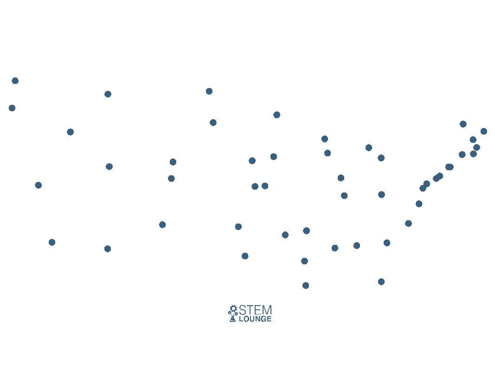

# Coding Problems Primer
Learn how to approach coding problems
****
## Prep for coding interviews
To get the most of this repository, navigate to [study guide](#Study Guide) before start solving issues.
Under main solution project there are a set of Java solutions for commonly asked interview coding problems. 
You can try to remove the code and write your own then run the tests. 
The purpose of this repo is not just for you to navigate through solutions and tests rather to apply what is being discussed in [study guide](#Study Guide) below and be able to tackle any problem with the right approach.
****

### How to navigate solution module
- Each package specifies the level of questions inside
- Each class contains different solutions for the same problem, and it has:
    - description
    - constrains
    - example input/output
    - time & space complexity
    - hints
****
## Study Guide
<br/>

**What's an algorithm?**

A procedure to accomplish a specific task (transform a set of inputs into desired output).
<br/>
****
**What can we consider as an algorithmic problem?**

A problem that's specified by describing the complete set of instances it must work on.
<br/>
****
**Example on a well-defined algorithmic problem?**

Sorting: a sequence of `n` entries `X1, X2, ... Xn`, where the desired output is: `X1' <= X2' <= ... <= Xn'`
****
**Insertion sort**


[gif source](https://www.google.com/url?sa=i&url=https%3A%2F%2Fwww.pinterest.com%2Fpin%2F420734790180626311%2F&psig=AOvVaw0J8yT_py2zc_TNRdYbJMdZ&ust=1642943133849000&source=images&cd=vfe&ved=2ahUKEwiG8KagtsX1AhXDtKQKHVugCuwQr4kDegUIARDxAQ)

```java
class Solution{
    void insertion(int[] entries){
        for(int i =1; i < entries.length; i++){
            int j = i;
            while(j > 0 && entries[j] < entries[j-1]){
                int temp = entries[j];
                entries[j] = entries[j-1];
                entries[j-1] = temp;
                j--;
            }
        }
    }
}
```
<br/>

****

**Properties of a good algorithm?**
- Correct
- Efficient
- Easy to implement

<br/>

****

**What's obvious IS NOT necessary correct?**

A proof of correctness should be conducted by adding proper tests that cover all edge cases where any input received by your algorithm should produce the desired output.

Examples on [heuristics](https://en.wikipedia.org/wiki/Heuristic_(computer_science)#:~:text=A%20heuristic%20function%2C%20also%20simply,may%20approximate%20the%20exact%20solution.) that obviously solves some variation of the problem but remains incorrect:
- Shortest path in a finite weighted graph solved by [nearest neighbor heuristic](https://stemlounge.com/animated-algorithms-for-the-traveling-salesman-problem/#:~:text=The%20nearest%20neighbor%20heuristic%20is,returns%20to%20the%20starting%20city.)



P.s. A formal proof of correctness can be conducted by doing a proper mathematical proof which will not be discussed here.

****

**A problem must acquire two main properties to be considered a valid problem for an algorithm**
- Contains a set of allowed input instances
- Describes precisely the desired output

****

**Ways to express an algorithm**
- English
- [Pseudo code](https://en.wikipedia.org/wiki/Pseudocode)
- Programming language

****

**Demonstrating incorrectness in an algorithm can be done by providing?**

A counterexample that is verifiable and simple.

****

**Common structures of combinatorial "recursive objects" objects (try to model your problem by linking it to one of the following)**
- Permutations: arrangements & ordering
- Subsets: a selection from a set of items
- Trees: a hierarchical relationships between items
- Graphs: a relationship between objects
- Points: define locations in some geometric space
- Polygons: define regions in some geometric spaces
- Strings: represent a sequence of characters or patterns


****

**Recursive objects**

Objects that preserve the same structure even after removing or adding an element to it.

****


NOTE: Recursion is a mathematical induction in action, you prove a solution to be working for some instances of the problem then apply it to all (base case checks up for smaller instance then you apply a general case where the assumption is: if it's true for some, it would be for the rest)

## References
- [The Algorithm Design Manual | Third edition](https://www.amazon.de/Algorithm-Design-Manual-Computer-Science/dp/3030542556/ref=asc_df_3030542556/?tag=googshopde-21&linkCode=df0&hvadid=447482713157&hvpos=&hvnetw=g&hvrand=85054541206852219&hvpone=&hvptwo=&hvqmt=&hvdev=c&hvdvcmdl=&hvlocint=&hvlocphy=1004363&hvtargid=pla-927547030735&psc=1&th=1&psc=1) - Steven S.S
- https://leetcode.com/
- https://codeforces.com/
- https://www.hackerrank.com/

## Contact 
Feel free to contact me to discuss any issues, questions, or comments.

#### Interested in contributing to this project? 
[Here is how to...](https://docs.github.com/en/get-started/quickstart/contributing-to-projects#about-forking)
